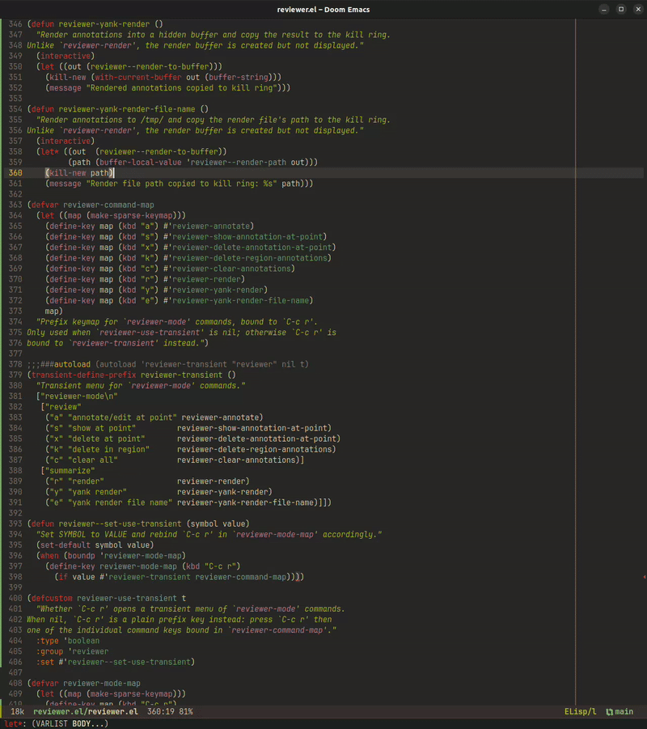

#+TITLE: reviewer.el

A minor mode for annotating a file or a diff (~C-c r a~ on a region or
word, editable in place) without changing its content, then rendering
those annotations as a plain org buffer -- file, line number(s), the
quoted span, and the note -- instead of injecting comments into the
source or exporting a hard-to-read diff.

Built for handing local review notes to an agent (e.g. [[https://github.com/xenodium/agent-shell][agent-shell]]),
not for submitting comments to a remote/forge. No persistence yet --
annotations are session-local -- though the data is kept simple enough
to serialize later if that's worth adding.

[[./images/demo.gif]]

* Usage

All commands live under the ~C-c r~ prefix, which by default (see
~reviewer-use-transient~ below) pops up a transient menu.

- ~C-c r a~ :: Annotate the active region (or word at point). On an
  existing annotation, edit its note instead. Either way, a small
  =*reviewer-annotation*= buffer pops up to edit the note text in --
  ~C-c C-c~ saves (clearing the text deletes the annotation), ~C-c C-k~
  cancels. Customize placement via
  ~reviewer-annotation-edit-buffer-action~, or an entry in
  ~display-buffer-alist~ keyed on the buffer name.
- ~C-c r s~ :: Show the annotation at point in a posframe (author,
  time, note), until the next command. Falls back to the echo area if
  [[https://github.com/tumashu/posframe][posframe]] isn't installed.
- ~C-c r x~ :: Delete the annotation at point.
- ~C-c r k~ :: Delete all annotations overlapping the active region.
- ~C-c r c~ :: Delete all annotations in the current buffer.
- ~C-c r r~ :: Render all annotations in the buffer as an org file in
  =/tmp/=, in a =*reviewer:file*= buffer. In the rendered buffer, ~n~/~p~ move
  between annotations and ~q~ quits.
- ~C-c r y~ :: Render annotations and copy the result to the kill
  ring, without displaying the render buffer.
- ~C-c r e~ :: Render annotations to =/tmp/= and copy the render
  file's path to the kill ring.

~reviewer-global-mode~ turns ~reviewer-mode~ on in every buffer.

** Transient menu

~C-c r~ opens a transient menu (via [[https://github.com/magit/transient][transient]]) listing all of the above
under "review" (annotation commands) and "summarize" (render
commands). Set ~reviewer-use-transient~ to ~nil~ to disable the popup and
make ~C-c r~ a plain prefix key instead -- e.g. ~C-c r a~ dispatches
straight to ~reviewer-annotate~ with no menu shown.

* Installation

** straight.el + use-package

#+BEGIN_SRC emacs-lisp
(use-package reviewer
  :straight (reviewer :type git :host github :repo "SreenivasVRao/reviewer.el")
  :hook (after-init . reviewer-global-mode))
#+END_SRC

For a local checkout instead of pulling from GitHub, use
~:local-repo~:

#+BEGIN_SRC emacs-lisp
(use-package reviewer
  :straight (reviewer :type git :local-repo "/path/to/reviewer.el")
  :hook (after-init . reviewer-global-mode))
#+END_SRC

** Doom Emacs

In =packages.el=:

#+BEGIN_SRC emacs-lisp
(package! reviewer
  :recipe (:host github :repo "SreenivasVRao/reviewer.el"))
#+END_SRC

In =config.el=:

#+BEGIN_SRC emacs-lisp
(use-package! reviewer
  :hook (after-init . reviewer-global-mode))
#+END_SRC

* Status

~reviewer-mode~ (create/edit/show annotations) and the org renderer
are both in place. No persistence across sessions yet.

* Comparison to related packages

** forge, lgtm.el, github-review, code-review

These all assume the thing under review is a pull request on a forge
(GitHub/GitLab/Bitbucket), and the endpoint is a remote submission --
approve/reject/comment via API calls, backed by OAuth tokens,
diff-hunk anchoring, and server-side threaded comments. reviewer.el
has none of that: no PR, no token, no server. It works on any buffer
-- a plain file, a diff, whatever's open -- and its output is an
org-mode dump meant to be read by a human or handed to an agent, not
posted anywhere.

** [[https://github.com/bastibe/annotate.el][annotate.el]]

The closer relative: same principle of a region/word-triggered,
in-place-editable annotation that leaves file content untouched.
annotate.el persists annotations to a database across sessions,
supports reply threads, and exports via its own markup format.
reviewer.el is deliberately narrower: no
persistence (session-local by design), no threading, and instead of a
custom export markup, it renders straight to a plain org buffer meant
for one-shot hand-off -- e.g. to an agent -- rather than long-term
review storage.
